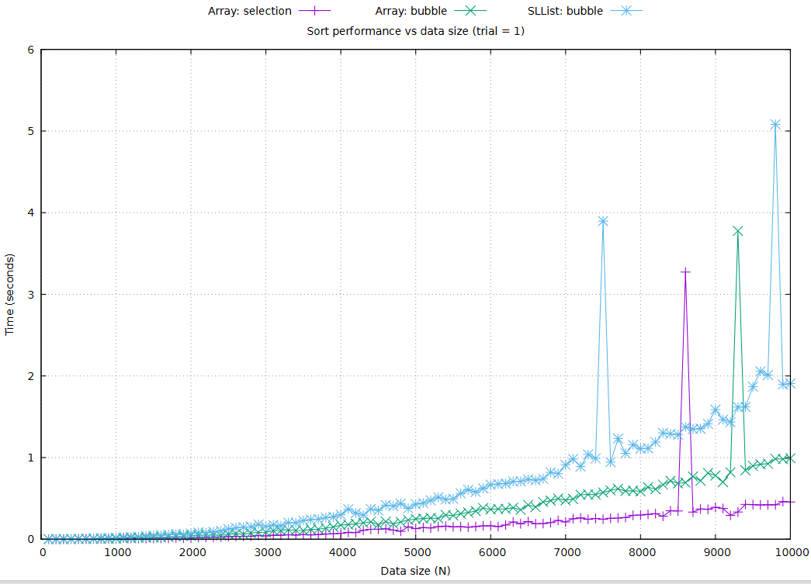
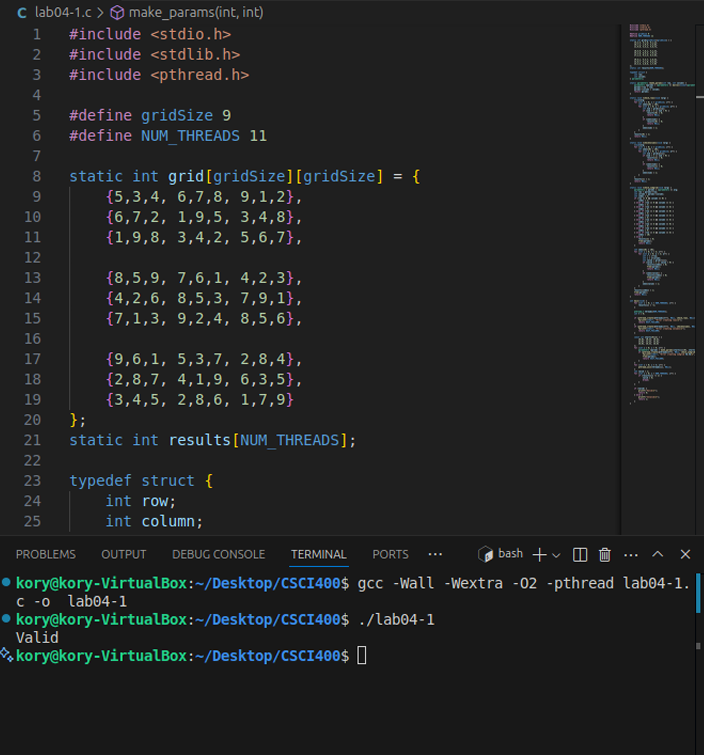
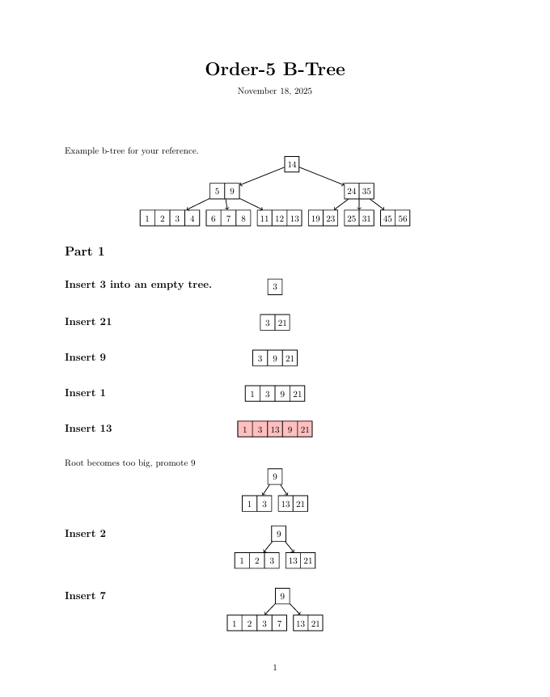

Portfolio
=========

Programming Projects
--------------------

*For access to my private project repositories, please [email me](mailto:example@KorySingleton35@gmail.com?subject=GitHub%20Access) with the subject line, GitHub Access.

---
### [Sort Time Analyzer for Manual Array\Singly-Linked List Objects | CSCI 315](https://github.com/KoryJSingleton/Sort-Time-Analyzer.git)

---
### [Hypotenuse Calculator | CSCI 301](https://github.com/KoryJSingleton/HypotenuseCalculator.git)

---
### [Sudoku Threader Prorgam | CSCI 431](https://github.com/KoryJSingleton/Sudoku-Threader-Program.git)

---
### [B-Tree Construction | CSCI 315](https://github.com/KoryJSingleton/B-Tree-Construction.git)

---

Ethics Papers
-------------

### [AI Ethic](/pdf/AI+Ethics.pdf)

-   **Class: CSCI 301**  
-   **Grade:80**

### [The Ethical Implications of Software Testing and Certification: A Christain Perspective](/pdf/Ethics%20Paper.pdf)

-   **Class: CSCI 315** 
-   **Grade: 80**

### [The Ethical Dilemma of Surveillance Software in Modern Operating Systems](/pdf/Surveillance%20Ai.pdf)

-   **Class:CSCE 311** 
-   **Grade:89**

---

Presentations
-------------

### [Surveillance Ai Presentation](/pdf/CSCE311_Ethics_Presentation_KorySingleton_Placeholders.pdf)

- **Class: CSCE 311** 
- **Grade:89**

### [SPARC Solaris Presentation](/pdf/uOracleSPARCSolaris-Presentation.pdf)

- **Class:CSCE 431** 
- **Grade: 90**

---

Page template forked from <a href="https://github.com/csu-cs/csci-portfolio">CSU-CS</a>

<!-- Remove above link if you don't want to attributive -->
