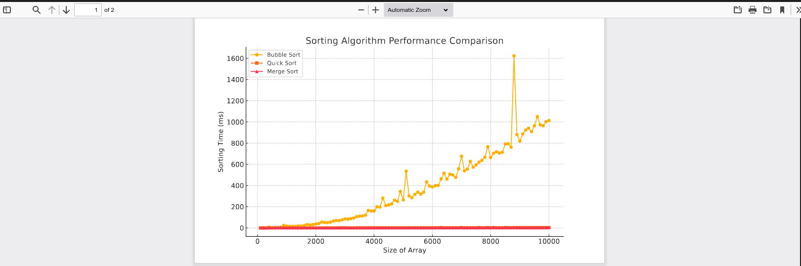
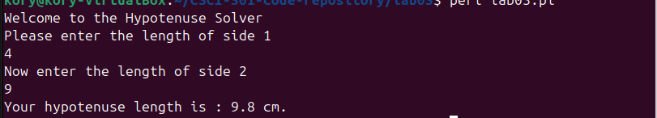
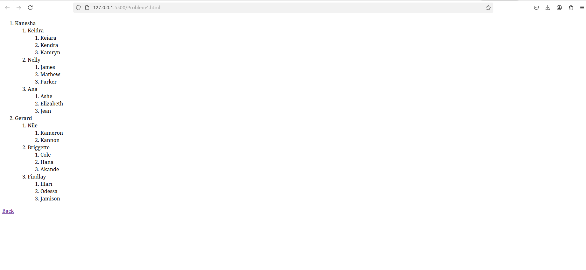
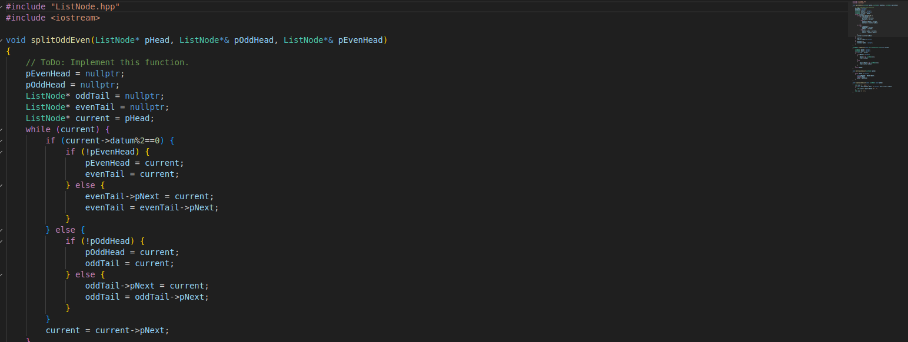

Portfolio
=========

Programming Projects
--------------------

*For access to my private project repositories, please [email me](mailto:example@KorySingleton35@gmail.com?subject=GitHub%20Access) with the subject line, GitHub Access.

---
### [Sort Time Analyzer | CSCI 315](project1)

---
### [Hypotenuse Calculator | CSCI 301](project2)

---
### [HTML Skill Assessment | CSCI 332](project3)

---
### [Timed Coding Exam | CSCI 315](project4)

---

Ethics Papers
-------------

### [AI Ethic](/pdf/AI+Ethics.pdf)

-   **Class: CSCI 301**  
-   **Grade:80**

### [Paper 2 Title](/pdf/Ethics%20Paper.pdf)

-   **Class: CSCI 325** 
-   **Grade:92**

### [Paper 3 Title](/pdf/Surveillance%20Ai.pdf)

-   **Class:CSCE 311** 
-   **Grade:89**

---

Presentations
-------------

### [Surveillance Ai Presentation](/pdf/CSCE311_Ethics_Presentation_KorySingleton_Placeholders.pdf)

- **Class: CSCE 311** 
- **Grade:89**

### [AI Ethics Presentation](/pdf/AI_Ethics_Presentation_KorySingleton_Styled.pdf)

- **Class:CSCE 301** 
- **Grade: Ungraded (not neccesary for assignment)**

---

Page template forked from <a href="https://github.com/csu-cs/csci-portfolio">CSU-CS</a>

<!-- Remove above link if you don't want to attributive -->
