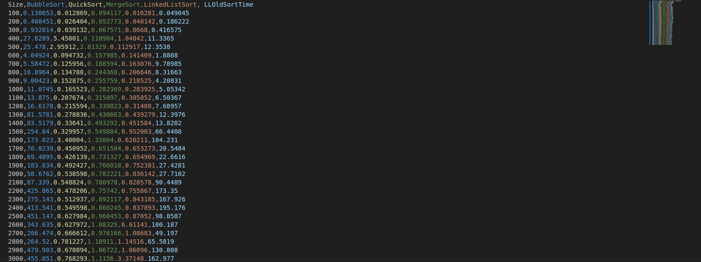

[Back to Portfolio](./)

Sort Time Analyzer
===============

-   **Class: CSCI 315** 
-   **Grade: 80** 
-   **Language(s): CPP** 
-   **Source Code Repository:** [features/mastering-markdown](https://github.com/KoryJSingleton/Sort-Time-Analyzer)  
    (Please [email me](mailto:example@KorySingleton35@gmail.com?subject=GitHub%20Access) to request access.)

## Project description

In this program, I seek to compile and display sort times from 3 different sorting algorithmns (bubble, quick and mergesort). To do so, the program, upon startup, constrcuts a number of arrays and singly-linked lists to be sorted. The amount of time needed for each program is tracked and then placed into a .csv file, which is created in the same repository as the rest of the program. From there, I took the data from the .csv and made it into a graph to make the difference in time more easily viewable for the reader, however, this part of the function isn't done by the source code.

## How to compile and run the program

How to compile (if applicable) and run the project.

```bash
cd ./lab11
make run
```

If the programming language does not require compilation, the update the heading to be “How to run the program.” If your application is deployed on a remote service, including instructions on how to deploy it.

## UI Design

There is very little user input. All that the user is required to do is 'cd' into the correct directory and then run the program  usssing 'make run'. 

  
Fig 1. Example sort output graphed

  
Fig 2. Example output.

  
Fig 3. Example ouput to show non-static code.

## 3. Additional Considerations

Again, it is of note that the program will not create a new graph upon each instance running the code. The included instance is with the intent to make the differences in time more visibile for the reader.

[Back to Portfolio](./)
