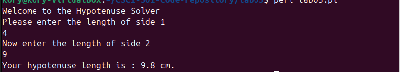

[Back to Portfolio](./)

Sort Time Analyzer
===============

-   **Class: CSCI 301** 
-   **Grade: 11th** 
-   **Language(s): Perl** 
-   **Source Code Repository:** [features/mastering-markdown](https://github.com/KoryJSingleton/HypotenuseCalculator)  
    (Please [email me](mailto:example@KorySingleton35@gmail.com?subject=GitHub%20Access) to request access.)

## Project description

In this program, I aimed to create a simple hypotenuse calculator. In essence, it presents as a fairly simple mathematical function, however, it shows a solid foundational understanding of the perl programming langaugeg and associated math functionality.

## How to compile and run the program

How to compile (if applicable) and run the project.

```bash
cd ./Project2
perl Project2.prl
```

If the programming language does not require compilation, the update the heading to be “How to run the program.” If your application is deployed on a remote service, including instructions on how to deploy it.

## UI Design

The program is intended to be run from the terminal on your computer, although it should function normally on any proper compiler or or code editors. Upon startup, the prorgam will ask the user for a number (representing one non-hypotenuse side), which the user can input and then confirm, by pressing the enter key. This process is then repeated for the second side of the triangle. From there, the program will calculate and output the hypotenuse for the triangle.

  
Fig 1. Example output using simple numbers

  
Fig 2. Example output using decimal numbers

  
Fig 3. Example ouput showing error situation

## 3. Additional Considerations

There are no additional considerations to be added for this project.

[Back to Portfolio](./)
