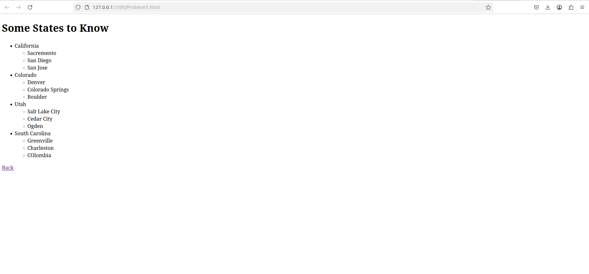
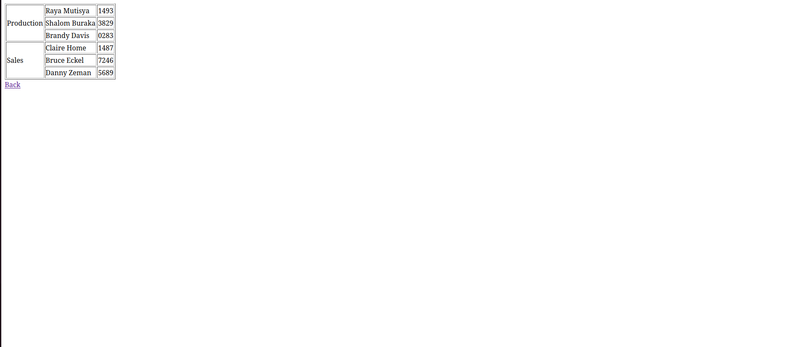

[Back to Portfolio](./)

HTML Skill Assessment
===============

-   **Class: CSCI 332** 
-   **Grade: 100** 
-   **Language(s): HTML** 
-   **Source Code Repository:** [Skill Assessment](https://github.com/KoryJSingleton/HTML_Skill-Assessment/tree/main)  
    (Please [email me](mailto:example@KorySingleton35@gmail.com?subject=GitHub%20Access) to request access.)

## Project description

This project was a compilation of tasked put forth by the professor to see if we could handle each respective task. It focuses heavily on the use of lists although the final question focuses on image mapping adn the ability to link certain parts of an image to various sites.

## How to compile and run the program

How to compile (if applicable) and run the project.

Download the accompanying files
On the index.html file, right click and selecte "open with browser"

If the programming language does not require compilation, the update the heading to be “How to run the program.” If your application is deployed on a remote service, including instructions on how to deploy it.

## UI Design

This takes the form of a very light website structure. There are hyperinks that the user can select to move to and from different pages.

  
Fig 1. Page showing problem 2

  
Fig 2.Page showing problem 3

  
Fig 3. Page showing Problem 4

## 3. Additional Considerations

There are no additional considerations to be added for this project.

[Back to Portfolio](./)
